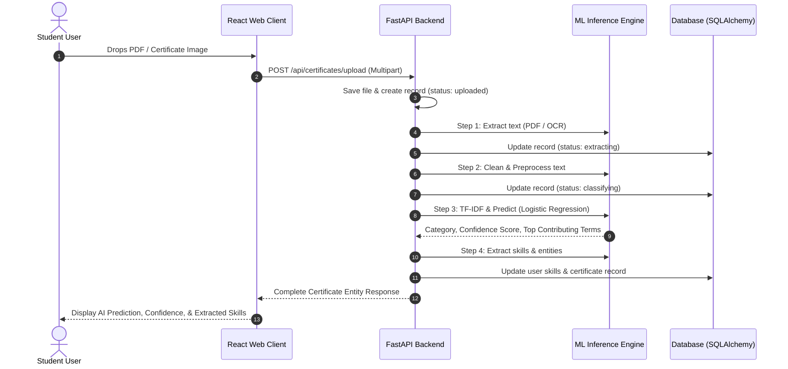

# CertiNexus AI — System Architecture & Design Specification

**Course**: 20MSSL12 Machine Learning Lab  
**Application Architecture**: 3-Tier Decoupled Micro-Modular System  

---

## 1. High-Level System Architecture

CertiNexus AI is organized into three distinct, loosely coupled layers:
1. **Presentation Layer (Web Client)**: High-performance single page application built with React 19, Vite, Framer Motion, and the custom Liquid Glass AI design token architecture.
2. **Application & API Layer (Backend Server)**: Asynchronous RESTful service built with FastAPI, executing authentication, certificate processing orchestration, skill extraction, and database transactions.
3. **Machine Learning & Inference Layer**: Serialized scikit-learn preprocessing and classification pipelines, integrated with OCR extraction engines and feature explainability modules.

```mermaid
graph TD
    subgraph Client["Web Client (React 19 + Liquid Glass UI)"]
        UI_Home[Landing / 3D Constellation]
        UI_Dash[Dashboard & Bento Grid]
        UI_Upload[Certificate Upload Dropzone]
        UI_Review[Certificate Details & Corrections]
        UI_Portfolio[Public & Private Portfolio]
        UI_Resume[Resume Builder & PDF Engine]
        UI_ML[ML Research Dashboard]
    end

    subgraph API["FastAPI Application Server"]
        Router_Auth["/api/auth (JWT)"]
        Router_Certs["/api/certificates"]
        Router_Resume["/api/resume"]
        Router_Port["/api/portfolio"]
        Router_Admin["/api/admin (ML Metrics)"]
    end

    subgraph MLLayer["ML Intelligence Pipeline"]
        OCR[OCR Service: PyMuPDF / EasyOCR]
        Preproc[TextPreprocessor Transformer]
        Vec[TF-IDF Vectorizer (1,2-grams)]
        Clf[Logistic Regression Classifier]
        Explainer[Important Terms Attribution]
        SkillExt[Skill & Entity Extractor]
    end

    subgraph DataStore["Persistence & Storage Layer"]
        DB[(SQLite / PostgreSQL via SQLAlchemy)]
        FileStore[Local / Object Storage: storage/uploads/]
        Artifacts[ML Artifacts: ml/models/production/]
    end

    Client -->|HTTP / JSON REST| API
    Router_Certs --> OCR
    OCR --> Preproc
    Preproc --> Vec
    Vec --> Clf
    Clf --> Explainer
    Clf --> SkillExt
    API --> DB
    Router_Certs --> FileStore
    Clf -.->|Loads Model| Artifacts
```

---

## 2. Data Flow & Processing Pipeline

When a student uploads a certificate document (PDF or Image):



---

## 3. Relational Database Schema

The database model is implemented with SQLAlchemy ORM (`backend/app/models/`):

### 3.1 Entity Relationship Overview
- **`users`**: Core user authentication and student profiles (`id`, `email`, `hashed_password`, `full_name`, `institution`, `department`, `graduation_year`, `portfolio_public`, `portfolio_theme`).
- **`certificates`**: Certificate documents and AI predictions (`id`, `user_id`, `original_filename`, `file_path`, `category`, `ai_category`, `ai_confidence`, `ai_confidence_level`, `ai_important_terms`, `raw_ocr_text`, `status`, `is_reviewed`).
- **`student_skills`**: Aggregated student technical and domain skills (`id`, `user_id`, `skill_name`, `skill_category`, `confidence`, `occurrence_count`, `source_certificate_id`).
- **`model_feedback`**: Audit log capturing human-in-the-loop corrections for active learning (`id`, `certificate_id`, `original_prediction`, `corrected_label`, `model_version`, `timestamp`).
- **`experiments`**: Log of all formal empirical model training iterations and metrics.

---

## 4. Machine Learning Inference Engine Design

The production inference pipeline (`ml/inference/predictor.py`) encapsulates:
1. **Thread-Safe Model Loading**: Loads the serialized scikit-learn pipeline using `joblib` into memory upon service initialization.
2. **Confidence-Aware Triaging**:
   $$\text{Thresholds: } \begin{cases} \text{High Confidence} & p \ge 0.85 \\ \text{Medium Confidence} & 0.70 \le p < 0.85 \\ \text{Low Confidence} & p < 0.70 \end{cases}$$
3. **Feature Attribution (Important Terms)**: For the predicted class $k$, inspects non-zero TF-IDF features $x_i$ and multiplies by the corresponding linear weights $w_{ki}$:
   $$\text{Importance}(w_i) = x_i \times w_{ki}$$
   The top 5 positive terms are returned to provide real-time interpretability.

---

## 5. Security & Privacy Architecture

- **Authentication**: Stateless JSON Web Tokens (JWT) signed using HMAC-SHA256 with cryptographically generated secret keys and short-lived expiration (60 minutes).
- **Password Protection**: Passwords hashed using `bcrypt` with automated salt generation.
- **Upload Validation**: Content-Type validation, magic byte verification, and 10MB payload size limits protect against arbitrary file execution.
- **Role-Based Access Control**: Strict multi-tenant isolation ensuring students can only read, update, or delete their own certificates and profile records.
