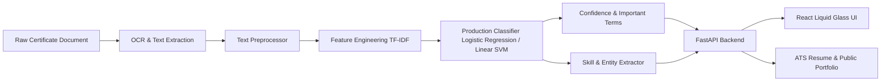

# CertiNexus AI — Project Proposal

**Course**: 20MSSL12 Machine Learning Lab  
**Program**: Five-Year Integrated M.Sc. (Software Systems)  
**Project Title**: CertiNexus AI: Intelligent Student Digital Portfolio & Certificate Intelligence Platform  
**Academic Year**: 2026–2027  
**Status**: Approved & Implemented  

---

## 1. Executive Summary & Problem Statement

Throughout their academic tenure, university students accrue numerous certifications, participation records, hackathon awards, academic honors, and workshop credentials. However, this repository of student achievement faces several critical challenges:

1. **Information Fragmentation**: Certificates reside scattered across local drives, emails, cloud storage, and physical paper copies, hindering rapid retrieval during placement season or academic appraisals.
2. **Unstructured Data Inefficiency**: Certificate documents (PDFs, scans, digital images) are inherently unstructured text formats. Manually transcribing credentials, dates, skills, and categories into curriculum vitae is error-prone and time-consuming.
3. **Absence of Intelligent Categorization**: Conventional digital lockers lack machine intelligence to classify achievements into meaningful domains (e.g., distinguishing an *Internship Certificate* from an *Academic Honor* or *Workshop Participation*).
4. **Verification Gap**: Portfolios frequently suffer from unverified claims. A unified system linking verifiable raw document text with extracted skills and confidence-scored predictions creates high-trust academic credentials.

**CertiNexus AI** resolves these challenges by introducing an end-to-end Machine Learning-powered certificate intelligence system. It combines optical character recognition (OCR), NLP-driven text cleaning, multi-class classification, skill taxonomy mapping, and a reactive glassmorphic digital portfolio.

---

## 2. ML Problem Formulation

### 2.1 Formal Machine Learning Task
The core academic ML problem is formulated as **Multi-Class Supervised Text Classification**:

$$\hat{y} = \arg\max_{c \in \mathcal{C}} P(y = c \mid \mathbf{x})$$

Where:
- $\mathbf{x} \in \mathcal{X}$: Preprocessed natural language text extracted from a student credential document.
- $\mathcal{C}$: Set of 11 mutually exclusive certificate domains:
  1. `Academic Achievement`
  2. `Certification`
  3. `Conference`
  4. `Cultural Activity`
  5. `Hackathon`
  6. `Internship`
  7. `Seminar`
  8. `Sports`
  9. `Technical Competition`
  10. `Volunteer Activity`
  11. `Workshop`
- $\hat{y}$: Predicted certificate category with associated probability vector and confidence metric.

### 2.2 Complementary ML Subtasks
- **Information Extraction (IE)**: Extracting candidate entities (issuing organization, credential recipient, issue date, verification ID) using rule-based and regular expression patterns.
- **Skill Discovery**: Automatic extraction and normalization of key technical and soft skills mapped against an industry skill dictionary.
- **Confidence Scoring & Active Routing**: Calculating prediction entropy to route low-confidence classifications ($\text{confidence} < 0.70$) to human-in-the-loop verification.

---

## 3. Project Objectives & Scope

### 3.1 Primary Objectives
1. **Develop an Academic ML Pipeline**: Formulate, train, tune, and evaluate multiple candidate classification algorithms (Multinomial Naive Bayes baseline, Logistic Regression, Linear Support Vector Machine) with strict 70/15/15 stratified train/validation/test methodology.
2. **Feature Engineering Exploration**: Quantitatively assess TF-IDF word n-grams, word+character n-grams, and length/domain-enriched features.
3. **Reproducible Experimentation**: Log all experimental parameters, cross-validation scores, inference latencies, and macro-F1 metrics into a structured experiment tracker (`experiments.csv`).
4. **End-to-End Production Deployment**: Wrap the optimal serialized model (`pipeline.joblib`) within a high-performance FastAPI backend and expose real-time inferencing with confidence metrics and feature explainability (important terms).
5. **Interactive Student Portfolio & Resume Engine**: Build a responsive React web interface featuring the *Liquid Glass AI* design aesthetic, providing students with interactive analytics, portfolio publishing, and verified resume compilation.

### 3.2 Academic Scope Boundary
- **In Scope**: Supervised classification across 11 target categories, synthetic corpus creation with realistic noise modeling, feature ablation, hyperparameter grid search, error analysis, RESTful API architecture, interactive web dashboard.
- **Out of Scope for Initial Milestone**: Deep transformer pretraining (e.g., full BERT/LayoutLM fine-tuning), hardware-accelerated on-device edge training, distributed multi-node GPU clusters.

---

## 4. Methodology Overview

---

## 5. Academic Milestones & Deliverables

| Milestone | Deliverable | Status |
| :--- | :--- | :--- |
| **M1: Proposal & Scoping** | Problem definition, course alignment, target metrics | Complete |
| **M2: Dataset & Preprocessing** | 500+ sample corpus, 11 classes, EDA visualizations | Complete |
| **M3: Model Experimentation** | Baseline NB, Logistic Regression, Linear SVM, tuning | Complete |
| **M4: Evaluation & Error Analysis** | Held-out test evaluation, confusion matrix, error audit | Complete |
| **M5: Full-Stack Integration** | FastAPI REST backend, SQLite/SQLAlchemy ORM, JWT auth | Complete |
| **M6: Web Frontend & Resume Engine** | React 19 Liquid Glass UI, public portfolios, resume export | Complete |
| **M7: Academic Documentation** | Full research documentation, data cards, architecture | Complete |

---

## 6. Ethical, Legal, and Privacy Considerations

- **Synthetic Corpus Compliance**: Real student certificates contain Personally Identifiable Information (PII) like national IDs, roll numbers, and physical signatures. To eliminate GDPR/privacy violations, a specialized corpus generator was designed to synthesize realistic certificate text with simulated OCR noise.
- **Model Explainability**: To prevent algorithmic bias and black-box frustration, the model surfaces top contributing terms for each prediction, empowering students to understand why a classification was made.
- **Human-in-the-Loop Safeguards**: Students retain full authority to correct predictions. Corrected records are systematically captured for active learning retraining cycles.
